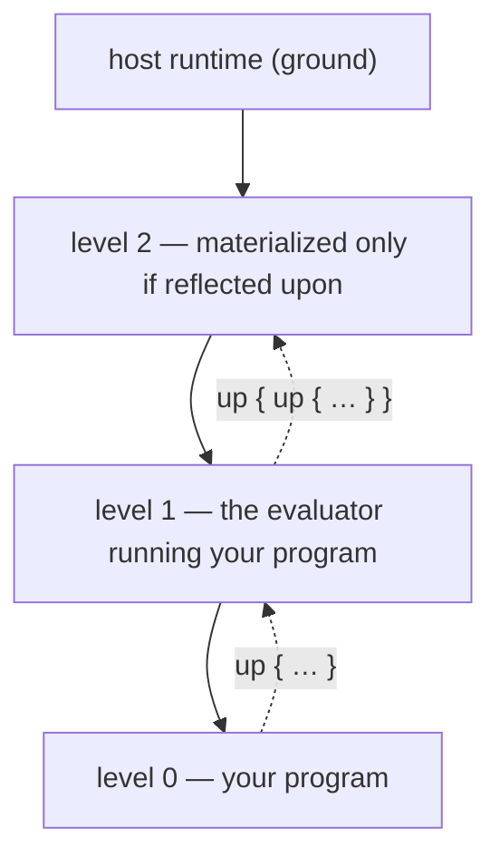

# Ash — a reflective tower that collapses

> [!abstract] The one-sentence version
> Build a small language whose interpreter is written in itself all the way up, let user code climb the tower and rewrite the interpreter running it, then use a staged partial evaluator to squash an *n*-level tower back into one flat program — and determine precisely which parts could be erased and which parts intrinsically could not.

Lineage: **Brown** (Wand & Friedman) → **Blond** (Danvy & Malmkjær) → **Black** (Asai) → **Pink/Purple** (Amin & Rompf) → **Ash**. Which is also what's left after a tower collapses.

> [!info] Revision 2
> This revision resolves an internal contradiction about CPS, adds hygienic identifiers and `LetRec` to Core, elevates open-recursive evaluator dispatch to a named invariant, redesigns `meta_with` as overlay frames, adds an effect policy for specialization, scopes the collapse-invariance claim properly, and removes several over-confident performance predictions.

> [!info] Revision 3
> The implementation host is now OCaml. Racket remains the fastest exploratory
> prototype option, but OCaml's algebraic data types, exhaustiveness checking,
> garbage collection, and module boundaries are a better fit for a long-running,
> agent-assisted implementation.

---

## 1. What you are actually building

Four artifacts. Each is defensible alone if you run out of runway.

| # | Artifact | What it is |
|---|----------|-----------|
| 1 | **Ash core** | Surface language, Core IR with hygienic binders, CPS evaluator, reader/printer |
| 2 | **The tower** | Ash's evaluator written in Ash, instantiated lazily, open-recursive, with `up` / reifiers |
| 3 | **The collapser** | Staged specializer that eats an *n*-level tower and emits one flat Core program, instrumented |
| 4 | **The classification** | A machine-checked account of which programs collapse fully, which leave interpreter residue, and where the boundary sits |

Artifact 4 is the actual deliverable. Artifacts 1–3 are how you earn the right to state it.

> [!important] The governing question
> Amin & Rompf already established that reflective towers *can* be collapsed. The open question this project can attack is sharper: **where is the boundary between reflection that is merely a static description of altered semantics, and reflection that constitutes irreducible runtime semantic choice?** Everything below is in service of making that question measurable.

---

## 2. Load-bearing decisions — settle these before Phase 0

Each of these is a place where a small early choice forces a large late rewrite. They are ordered by how expensive they are to get wrong.

### D1. Core identifiers are hygienic, not strings

```
Ident = { printed: String, id: Nat }
```

`fn(x₁₇₃) -> x₁₇₃` and `x₄₂` both print as `x` and are fundamentally different terms.

This one decision buys you:

- hygienic quotation and splicing **by construction**, not by discipline
- alpha-equivalence as structural equality after ID canonicalization — which the Phase 6 invariance claim depends on entirely
- safe specializer-generated binders
- a printer that alpha-normalizes back to readable names

A free-variable check at `run` time catches *unbound*, never *captured*. Splicing `` `{ x } `` under a fresh `fn(x) -> …` yields a term with no free variables and possibly the wrong meaning. Only intrinsic hygiene distinguishes those.

> [!danger] Hygiene and reflection genuinely conflict here
> Reflective code builds `Var` nodes from runtime strings — that is much of what reflection *is*. `up { eval(Var("x"), env, k) }` has nowhere to obtain a `binder_id`.
>
> Resolve it explicitly rather than discovering it in Phase 4. Provide two constructors:
>
> - `Var(ident)` — statically bound, carries a binder ID, hygienic.
> - `NamedVar(string)` — resolved by printed name against a first-class `Env` at evaluation time.
>
> `NamedVar` is a distinct Core node, not a `Var` with a null ID. The specializer must be able to see the difference, because a `NamedVar` whose target environment isn't statically known is a specialization barrier. Reflective interpreters will use it; ordinary compiled code will not. Making it a separate node means the collapse report can say *how many* name-resolved lookups survived.

### D2. CPS from day one; direct style only as an oracle

Revision 1 contradicted itself here. The resolution:

```
reference_eval : Core -> Val                 # direct style, ~100 lines, an oracle
real_eval      : Core × Env × Cont -> Ans    # CPS, the actual system
```

Write `real_eval` in CPS immediately. Reflective procedures receive the continuation of the level below; in direct style that lives on the host stack where you cannot reach it.

Write `reference_eval` too, but **never extend it** — no reflection, no staging, no continuations. Its sole job is differential testing on the ordinary-Core corpus:

```
∀ p ∈ pure_corpus.  reference_eval(p) ≡ real_eval(p, ∅, id)
```

That oracle is worth its hundred lines many times over during Phase 1, when the CPS rewrite is subtly wrong in ways that only show up three phases later.

### D3. The evaluator must be open-recursive

**This is the invariant the whole tower rests on, and it is easy to violate accidentally.**

The naive shape:

```
eval  ──recursively calls──> eval   (captured self-reference)
```

Then:

```ash
up { eval := tracing(eval) }
```

intercepts only the *outermost* entry. The moment `tracing` delegates to the original, every recursive step bypasses the tracer. Your tracing demo prints one line and looks broken for reasons that take a day to find.

Required shape:

```
every recursive evaluation step
        ↓
   deref eval-cell
        ↓
  invoke current evaluator
```

> [!important] Invariant OR
> **All recursive calls among reflective evaluator functions resolve dynamically through their mutable meta-level cells.** No evaluator function may hold a direct reference to another member of its own mutually recursive group.

Amin & Rompf make exactly this choice in Purple, and it is the reason user modifications remain effective through arbitrary evaluation depth rather than only at the entry point.

Surface support, so the discipline is enforced rather than remembered:

```ash
open fn eval(e, r, k) = …
open fn apply(f, vs, k) = …
open fn eval_list(es, r, k) = …
```

`open` means: within this mutually recursive group, references to group members compile to cell dereferences through the current level's meta-environment rather than to direct calls.

**Test it in Phase 2, not Phase 4:**

```ash
var hits = 0
up { let base = eval; eval := fn(e,r,k) -> { hits := hits + 1; base(e,r,k) } }
run(`{ 1 + (2 * (3 - (4 / 5))) }`)
assert hits >= 9      # every node, not just the root
```

> [!tip] This invariant is also the collapse mechanism
> The cell dereference is an indirection at *every* evaluation step. If interpreter identity is statically known, the specializer folds it away and you get a fully collapsed program. If it isn't, the dereference survives.
>
> **The surviving `eval`-cell dereferences in a residual program are precisely the interpreter residue.** §9's classification and this invariant are the same phenomenon seen from opposite ends. Instrument the cell from the beginning.

### D4. Continuations: first-class and one-shot, initially

CPS gives you the *representation*. It does not give you multi-shot `call/cc`, mutable cells, staged execution, and dynamically scoped meta-state coexisting soundly. That combination is not "almost free," and Revision 1 was wrong to say so.

Start with **one-shot continuations that are still first-class**: storable in data structures, passable to reifiers, invocable exactly once from anywhere. Not escape-only — an escape continuation cannot be handed to a meta-level procedure and resumed after the meta level does work, which is most of what reifiers exist for.

Know what you're deferring: backtracking reifiers, `amb`, generator-style re-entry, and re-entrant `meta_with` all require multi-shot. They're good demos. They're not needed for the headline result.

Enforce one-shot-ness dynamically: a `used` flag on the continuation object, with a clear error on second invocation. That error will save you from a class of silent corruption during Phase 8.

### D5. `run` takes closed code

```
run : ClosedCode -> Val
```

Quoted code may be open *while being constructed*. `run` rejects code with unresolved lexical dependencies. If you want "evaluate this code in that environment," you already have the explicit mechanisms:

```ash
eval(code, env, k)
reflect(code, env, k)
```

Letting `run` implicitly inherit the caller's lexical environment drags in cross-stage persistence before you need it. This also gives the free-variable checker a permanent job even after D1 makes hygiene intrinsic.

Closedness is relative only to the current level's explicit global environment:
hygienic references to that level's primitive globals are resolved, while a
lexical frame introduced by a caller is not. Report every unresolved identity
and every occurrence location, in source order, rather than failing on the first.
A nested `Quote` retains the surrounding lexical scope and is traversed;
`NamedVar` is instead an explicit request for printed-name lookup during
execution, still against the same global environment.

### D6. `lift` has a small, fixed domain

| Value | Liftable? |
|-------|-----------|
| numbers, booleans, strings, symbols, unit | yes |
| immutable lists of liftable values | yes |
| `Code` | yes |
| closures | **no** |
| continuations | **no** |
| environments | **no** |
| cells | **no** |
| reifiers, primitives, any future unlisted shape | **no** |

Closures bring sharing, identity, mutable captured cells, recursive cycles, and environment representation with them. The specializer does not need general closure lifting: it residualizes a lambda from the lambda's *syntax* plus static/dynamic knowledge of what it captures. Closure serialization is a later experiment, not a v1 requirement.

`Code` passes through unchanged, including provenance. A non-empty list lifts to
an application of the current level's exact hygienic `list` global, never a
`NamedVar` lookup; every invented node retains the `lift` call as generated
provenance. Rejection is exhaustive over everything outside the table's positive
rows. Its structured error points at the source call and records the one-based
path through nested lists to the rejected value, naming its data origin rather
than only its type.

### D7. Primitives are stage-polymorphic *by class*, not uniformly

"Every primitive is stage-polymorphic" is wrong as stated, and wrong in a way that produces incorrect compilers rather than slow ones.

`print("hello")` with a static argument, under a naive rule, executes during specialization. Now *compilation* prints `hello` and *running the compiled program* does not. Similarly, statically executing `set` mutates specializer-time state instead of runtime state.

Fix the policy before the specializer exists:

| Class | Primitives | Specialization behaviour |
|-------|-----------|--------------------------|
| **Pure** | arithmetic, comparison, immutable list ops, `Code` constructors | fold when everything the primitive *inspects* is static (see below) |
| **Allocation / mutation** | `cell_new`, `deref`, `set` | residualize by default; a `Set` on a binding is static only where the store-splitting discipline of §7.4 proves the specializer owns the cell (task 7.2); the allocation primitives still residualize |
| **Observable effect** | `print`, `read`, IO | **always residualize.** Never execute at specialization time. |
| **Control** | `call/cc`, `resume`, `abort` | bespoke; residualize unless the entire control flow is static |
| **Reflection** | `lift`, `run`, `up`, `reflect`, reifier application | bespoke; this is the classification target |

"All arguments static" is the right rule for arithmetic and for `==`, and too strong for the immutable list operations. `head`, `tail`, `empty?`, `length`, and `list?` answer from a list's *spine*; `cons` looks at the shape of its tail and never at the value it conses; `list` looks at nothing. Requiring their elements to be static as well is what would make §7.3's discipline — the environment's *shape* is static while its *contents* are dynamic — unavailable to data, and with it the unrolling of any loop over a statically shaped list of dynamic values.

So a primitive carries a second field beside its class: how much of each argument it inspects, one of *whole value*, *shape only*, or *unobserved*, defaulting to whole value. A pure primitive folds when its class permits it and nothing it inspects is dynamic. Class still dominates: no argument knowledge makes `print` foldable. (Recorded in ADR 0028; implemented as `Ash_core.Observation` and `Stage_value.may_fold`.)

If you want compile-time logging, give it a separate primitive (`static_log`) that is *defined* to run at specialization time. Don't overload `print`.

### D8. Meta-overrides are overlay frames, not save-mutate-restore

```
persistent meta environment
        ↑
  override frame
        ↑
  override frame
```

`meta_with` pushes a frame; a captured continuation captures a *pointer* to the meta-context in effect at capture time. This makes two mechanisms genuinely distinct:

```ash
up { eval := tracing(eval) }               # persistent: mutates the cell
meta_with(eval = tracing(eval)) { … }      # dynamic: pushes a frame
```

The save/mutate/restore design from Revision 1 becomes unsound the moment a continuation captured inside the extent is invoked from outside it — and worse under multi-shot, where "restore" has no well-defined meaning. Overlays sidestep this: there is nothing to restore, because leaving the extent means the frame is simply no longer on the path.

This also resolves an open question from Revision 1 — whether meta bindings are part of captured continuation state. With overlays, yes, automatically, and without `dynamic-wind`-flavoured heroics.

### D9. Level numbering: decide absolute vs relative deliberately

Exposing `level : Int` to reflective programs means a program can observe where it sits in the tower — which breaks any hope of a clean cross-depth invariance theorem.

But the tower is infinite, so *absolute* position is arguably ill-defined anyway. Two options:

- **Relative** (`level` counts upward from the base program; base is always 0). A program under 1 interpreter and under 5 sees the same relative structure. Depth observation via `level` disappears and invariance holds more broadly.
- **Absolute** (numbered from some materialized ground). Creates a genuine class of depth-sensitive programs, which makes the §9 classification non-trivial and gives you something more interesting to study.

**Recommendation: relative for the base language, with an explicit `tower_depth()` primitive for programs that deliberately want to be depth-sensitive.** You get the clean theorem for the default fragment *and* a well-marked opt-in that populates the depth-sensitive class. Marking it as a distinct primitive also means the collapse report can detect depth-sensitivity syntactically.

Regardless of choice: **timing, stack-depth, resource-exhaustion, and gensym-counter observation are excluded from the observational equivalence.** State this explicitly or the theorem is unfalsifiable.

---

## 3. The Core language

Ten forms. The self-interpreter handles exactly these.

```
Core ::= Lit c                    -- number | bool | string | symbol | unit | []
       | Var ident                -- hygienic, carries binder id
       | NamedVar string          -- reflective, resolved by name against an Env
       | Lam [ident…] body
       | App f [e…]
       | Let ident e body
       | LetRec [(ident, Lam)…] body
       | If c t f
       | Set ident e
       | Quote core
       | Reifier [e r k] body
```

That's eleven with `NamedVar`, which earns its place per D1.

**`LetRec` is a Core form, not sugar.** Recursion is not peripheral here — the interpreter is recursively defined and the specializer must reason about recursive functions. Encoding it through a call-by-value fixpoint combinator to save one constructor makes the self-interpreter clever when it needs to be boring. Implementation is the obvious one: allocate cells, evaluate the lambdas in the extended environment, fill the cells.

Derived sugar:

| Surface | Core |
|---------|------|
| `e1; e2` | `Let _fresh = e1 in e2` |
| `and` / `or` | `If` |
| `${e}` splice | primitive, applied during `Code` construction |
| `lift`, `run`, `reflect`, `up` | primitives / macro over `Reifier` |
| lists, arithmetic, IO | primitives |

### Values

```
Val ::= Num | Bool | Str | Sym | Unit | List
      | Clo   (params, body, env)
      | Reif  (params, body, env)
      | Cont  (k, used_flag)          -- one-shot, first-class (D4)
      | Env   (first-class environment)
      | Cell  (mutable box)
      | Code  (Core)                  -- the staging domain
```

`Code` living in the same domain as everything else is what makes the §7 specializer *online*: static values are real values, dynamic values are `Code`.

### Environments

```
Env   = List<Frame>
Frame = Map<Ident, Cell>
```

Cells rather than raw values, so a `set` from a meta level is visible to closures that already captured the binding. `LetRec` needs cells anyway.

---

## 4. Surface syntax

An ML/Rust-flavoured expression language, designed so that writing interpreters is pleasant — because you will write several.

### 4.1 Basics

```ash
# comments to end of line

let x = 42
var counter = 0
counter := counter + 1

fn square(x) = x * x
let double = fn(x) -> x * 2

fn fact(n) =
  if n == 0 then 1
  else n * fact(n - 1)

fn classify(n) = {
  let m = n % 3
  if m == 0 then 'zero else if m == 1 then 'one else 'two
}

[1, 2, 3]
1 :: [2, 3]
xs |> map(double) |> sum
```

Precedence, loosest to tightest:

```
|>
||
&&
== != < <= > >=
::            (right assoc)
+ -
* / %
unary - !
application, field access
```

### 4.2 Pattern matching

```ash
fn length(xs) =
  match xs {
    []      -> 0
    _ :: ys -> 1 + length(ys)
  }
```

Ash is dynamically typed, so structural patterns are refutable when the value
has the wrong shape. `match 5 { [] -> 'empty; _ -> 'other }` answers `'other`;
list accessors still raise when called directly on a non-list. Constructor
patterns use the same rule for non-Code subjects.

### 4.3 Quotation and splicing

```ash
let e = `{ 1 + 2 * 3 }
run(e)                    # 7

let a = `{ x }
let b = `{ ${a} + ${a} }

lift(42)                  # `{ 42 }`
```

Staged power:

```ash
fn power(n, x) =
  if n == 0 then `{ 1 }
  else `{ ${x} * ${power(n - 1, x)} }

let pow5 = `{ fn(y) -> ${power(5, `{ y })} }
run(pow5)(2)              # 32
```

Under D1, `` `{ y } `` carries `y`'s binder ID from the enclosing quotation, so splicing it under an unrelated `fn(y) -> …` cannot capture. Under D5, `run(pow5)` succeeds only because `pow5` is closed.

An otherwise unbound name inside a quotation receives a fresh hygienic identity,
so open Code can be assembled without turning it into name-resolved reflection.
Only explicit `NamedVar("x")` constructs a runtime string lookup. Splicing uses
fresh `Var` markers and exact identity replacement; Code equality is
alpha-equivalence. The immutable `code?`, `code_view`, `code_splice`,
`code_match`, and `NamedVar` operations are Pure under D7, not Reflection.

### 4.4 Quasiquote patterns

```ash
fn simplify(e) =
  match e {
    `{ ${a} + 0 }   -> simplify(a)
    `{ ${a} * 1 }   -> simplify(a)
    `{ ${a} * 0 }   -> `{ 0 }
    `{ ${f}(${x}) } -> `{ ${simplify(f)}(${simplify(x)}) }
    _               -> e
  }
```

Constructor patterns work too, and you'll want both:

```ash
match e {
  Lit(c)         -> …
  Var(x)         -> …
  NamedVar(s)    -> …
  Lam(ps,b)      -> …
  App(f,as)      -> …
  Let(x,e,b)     -> …
  LetRec(bs,b)   -> …
  If(c,t,f)      -> …
  Set(x,v)       -> …
  Quote(q)       -> …
  Reifier(ps,b)  -> …
}
```

Alternative patterns must bind the same set of names in every arm. For example,
`[x] | x :: []` is valid, while `Lit(c) | Var(x)` is not; separate match clauses
express the latter case, as above.

Quasiquote matching is alpha-aware. `${p}` marks one Core-node hole, captures
that subject node as Code, and then applies the full pattern `p` to it. A closed
template therefore matches alpha-renamed binders, while free hygienic variables
still compare by identity.

---

## 5. Reflection: the tower

### 5.1 The picture



Levels above the highest materialized one are potential, not real. A level nobody has reflected on is behaviourally identical to the default evaluator, so it runs natively on the host. Materialization is what makes a level cost something.

### 5.2 `up`

```ash
up { EXPR }
```

1. Level *n* suspends, capturing `(exp, env, cont)`.
2. If level *n+1* isn't materialized, materialize it: a fresh evaluator with a global environment cloned from the standard one, and fresh open-recursion cells (D3).
3. `EXPR` evaluates at level *n+1*, in its global env extended with the meta bindings below.
4. When `EXPR` yields `v`, level *n* resumes: `cont(v)`.

Meta bindings inside `up { }`:

| Name | Type | Meaning |
|------|------|---------|
| `exp` | `Code` | what level *n* was evaluating |
| `env` | `Env` | level *n*'s environment |
| `cont` | `Cont` | level *n*'s continuation (one-shot, D4) |
| `eval` | cell of `(Code, Env, Cont) -> Ans` | the open-recursion cell for level *n*'s evaluator |
| `apply` | cell | ditto |
| `global` | `Env` | level *n*'s global environment |
| `resume(k, v)` | | invoke a captured continuation |
| `meta_error(msg)` | | raise here, catchable at *n+1* |

`level` follows D9. If `EXPR` calls `resume(cont, w)` explicitly, level *n* resumes with `w` and the `up` form never returns normally.

### 5.3 The money demo

```ash
fn fib(n) = if n < 2 then n else fib(n-1) + fib(n-2)

up {
  let base = eval
  eval := fn(e, r, k) -> {
    print(indent(depth), show(e))
    base(e, r, k)
  }
}

fib(3)   # prints a complete trace of its own evaluation
```

Nothing about `fib` changed. It reached up and rewrote the machine underneath itself, mid-flight.

This demo works **only** if invariant OR holds. If it prints one line, D3 is violated.

### 5.4 Reifiers

`up` is sugar. The primitive is a reifier — a procedure whose arguments are not evaluated; it runs one level up with the caller's `(exp, env, cont)`:

```ash
let my_quote = reifier(exp, env, k) -> k(arg(exp, 0))
my_quote(1 + 2)     # `{ 1 + 2 }` — the code, not 3
```

`if` defined inside the language:

```ash
let my_if = reifier(exp, env, k) ->
  eval(arg(exp, 0), env, fn(b) ->
    if truthy(b)
      then eval(arg(exp, 1), env, k)
      else eval(arg(exp, 2), env, k))
```

`reflect(exp, env, cont)` is the inverse: from level *n+1*, drop to *n*. The identity reifier is the round trip:

```ash
let id = reifier(e, r, k) -> reflect(arg(e, 0), r, k)
# id(f(x)) ≡ f(x), including effects, evaluated exactly once
```

### 5.5 `meta_with` — dynamic overrides

Per D8, an overlay frame rather than mutate-and-restore:

```ash
meta_with(eval = tracing(eval)) {
  fib(3)
}
```

The classics offer only destructive mutation. Two distinct mechanisms is better than one mechanism plus restoration logic — and it is the only design that survives contact with first-class continuations.

> [!note] Not claiming novelty
> Dynamically scoped override with proper continuation interaction has substantial ancestry: `dynamic-wind`, Racket's `parameterize`, delimited dynamic binding, and algebraic effect handlers. Applying it to *meta-level evaluator bindings* is a good combination and a good language feature. Do a targeted literature search before describing it as new.

### 5.6 Level 2

```ash
up { up { eval := counting(eval) } }
```

Counting the steps the level-1 evaluator takes while interpreting your program. This is the demo that makes collapse *necessary*.

### 5.7 Laws to test

All but the overlay law are tested in `test/laws/tower_laws_test.ml`, at depths 0–5. "Depth *k*" there means *k* levels that are actually interpreting — each one running an identity interpreter written in Ash — because a level that is merely materialized is observationally the default evaluator by construction and would make transparency vacuous (ADR 0025).

- [x] **Transparency** — a program using no reflective operator produces identical values and identical observable effects at tower depth 0 and depth *k*, for all *k*. (Excluding the resource channels named in D9.) *(Done: 96 programs — the whole differential corpus plus observable-output cases — at depths 0–5. Level 0's own step count is invariant too, which is stronger than the law asks.)*
- [x] **Open recursion (OR)** — patching `eval` intercepts *every* recursive evaluation step, at arbitrary AST depth. Test in Phase 2. *(Done: `test/laws/open_recursion_test.ml`, including with the patched interpreter itself being interpreted; and at tower depth in `tower_laws_test.ml`, where the number of intercepted steps is shown not to depend on the tower's depth.)*
- [x] **Reifier identity** — `id` above is observationally `fn(x) -> x`, including for effectful and non-terminating arguments. *(Done: value, effect order, closure, and two failure shapes; nontermination by a counted Ash step cap, never by wall time.)*
- [x] **Level independence** — mutating `eval` at level *n+1* affects levels ≤ *n* and not level *n+1*'s own execution. *(Done, at depths 0–2. The negative half is the sharp one: a replacement that intercepted its own level would not return from its first step.)*
- [ ] **Overlay discipline** — a continuation captured inside a `meta_with` extent and invoked outside it sees the overlay; the ambient meta-context is unaffected. *(Phase 8; `meta_with` does not exist yet.)*
- [x] **Error propagation** — an error at level *n* is catchable at level *n+1* and only there. *(Done as ownership plus non-resumption: Core has no handler form, so "catchable at *n+1*" is observed as the error being attributed to *n+1* and level *n* never resuming. A primitive's own argument diagnostics still carry no level — ADR 0023 deferred that deliberately, and a test pins the current behaviour.)*
- [x] **One-shot enforcement** — second invocation of a continuation raises, rather than silently corrupting. *(Done, across the level boundary and at depth: the continuation is stored in a cell the level below shares, so it outlives the transfer.)*

---

## 6. The self-interpreter

The centre of the project. In Ash, over Core, in CPS, open-recursive.

```ash
open fn eval(e, r, k) =
  match e {
    Lit(c)         -> k(c)
    Var(x)         -> k(deref(lookup(r, x)))
    NamedVar(s)    -> k(deref(lookup_by_name(r, s)))
    Quote(q)       -> k(q)
    Lam(ps, b)     -> k(Clo(ps, b, r))
    Reifier(ps, b) -> k(Reif(ps, b, r))
    If(c, t, f)    -> eval(c, r, fn(b) ->
                        if truthy(b) then eval(t, r, k) else eval(f, r, k))
    Let(x, e1, b)  -> eval(e1, r, fn(v) -> eval(b, bind(r, x, cell(v)), k))
    LetRec(bs, b)  -> { let r2 = prealloc(r, binders(bs))
                        fill(r2, bs)
                        eval(b, r2, k) }
    Set(x, v)      -> eval(v, r, fn(w) -> k(assign(r, x, w)))
    App(f, as)     -> eval(f, r, fn(fv) ->
                        match fv {
                          Reif(_,_,_) -> shift_up(fv, e, r, k)
                          _           -> eval_list(as, r, fn(vs) -> apply(fv, vs, k, e))
                        })
  }

open fn apply(f, vs, k, site) =
  match f {
    Clo(ps, b, r) -> eval(b, extend(r, ps, vs), k)
    Prim(op)      -> k(invoke_at(site, op, vs))
    Cont(k2, u)   -> { check_unused(u); k2(head(vs)) }
  }

open fn eval_list(es, r, k) = …
```

Every occurrence of `eval` / `apply` / `eval_list` inside this group is, per `open`, a cell dereference. That is the tower's per-step cost *and* the site the collapser must eliminate.

Every line you add here gets multiplied by tower depth. Guard it jealously.

> [!note] Phase 3 transport
> Phase 2 first built this shape over a temporary tagged-list encoding. Phase 3
> has now retired that transport: `lib/self/eval.ash` receives real `Code` and
> dispatches with all eleven constructor patterns. Identifier fields remain
> one-node `Var` Code, and child nodes retain their source spans.
>
> `invoke_at` spreads a runtime argument list while attributing delegated errors
> to the subject `App`; `raise_at` carries the interpreter's closed structured
> error protocol to the subject node. The host/self differential therefore
> compares failure location as well as cause. See
> `docs/decisions/0021-real-code-self-interpreter.md`.

### 6.1 Lazy materialization

```
Machine = {
  materialized : Int
  levels       : Array<Level>
}
Level = {
  global : Env
  cells  : { eval: Cell, apply: Cell, eval_list: Cell, … }
  overlays : List<Frame>          # D8
}
```

- **`materialized == 0`** — level 0 runs on the host. Fast path, the common case.
- **First `up` from level 0** — materialize level 1. Level 0 now runs *through* `levels[1].cells.eval`.
- **`up` inside `up`** — materialize level 2. Level 1 now runs through level 2, and level 0 through level 1 through level 2.

> [!important] The key invariant
> You do **not** reconstruct what level *n+1* "would have been doing." You start it fresh in its own global environment, with `exp`/`env`/`cont` bound to level *n*'s state. This is what Black does, it is the only tractable option, and it is what most descriptions of towers gloss over. The infinite tower is finite because unmaterialized levels are *observationally* indistinguishable from the default — laziness here is observational, not structural.

---

## 7. Staging and the collapser

### 7.1 Value model

```
Val = … | Code(Core)
```

Pure primitives are stage-polymorphic:

```
add(Num a, Num b)  = Num(a + b)                 # static: fold
add(a, b)          = Code(`{ ${↑a} + ${↑b} }`)  # dynamic: emit
```

Other primitive classes follow D7. This is not a detail — it is the difference between a correct compiler and one that prints at compile time.

### 7.2 Let-insertion

Naive emission duplicates work and effects. Every emitted dynamic operation is bound by a fresh `let` in an ambient code buffer.

1. **Mutable accumulator** (LMS style). `var block: List<(Ident, Core)>`; `emit(c)` pushes and returns `Code(Var(fresh))`; `reify_block(thunk)` runs it with a fresh buffer and wraps the result in nested `Let`s. ~40 lines. Do this.
2. **`shift`/`reset`** — elegant, and you're already in CPS. Do it after (1) works, if the writeup wants it.

Every branch of a dynamic `If` and every dynamic `Lam` body gets its own `reify_block`. Fresh binders come from D1 for free.

### 7.3 The staged evaluator

The §6 evaluator with `maybe_lift` in the right places:

```ash
open fn eval(e, r, k) =
  match e {
    Lit(c)      -> k(maybe_lift(c))
    Var(x)      -> k(deref(lookup(r, x)))          # static lookup, dynamic value
    Lam(ps, b)  -> k(maybe_lift(fn(vs) -> eval(b, extend(r, ps, vs), id)))
    If(c, t, f) -> eval(c, r, fn(b) ->
                     if is_code(b)
                       then k(emit_if(b, reify_block(fn() -> eval(t, r, id)),
                                         reify_block(fn() -> eval(f, r, id))))
                       else if truthy(b) then eval(t, r, k) else eval(f, r, k))
    …
  }
```

The discipline in one line: **syntax is static, data is dynamic, and the environment's *shape* is static while its *contents* are dynamic.**

`maybe_lift` rather than `lift` is what lets one source serve as both evaluator (`maybe_lift = id`) and compiler (`maybe_lift = lift`). Amin & Rompf's result hinges on this; their §3 is the part worth re-reading three times.

### 7.4 Fragment ordering — do not generalize early

Scope the first success hard. Each step below is a separate substantial problem:

```
1. pure higher-order Core + recursion + immutable data     ← Phase 5, the first big win
2. + memoization, generalization, arbitrary tower depth    ← Phase 6
3. + mutable cells                                         ← Phase 7
4. + observable effects                                    ← Phase 7
5. + static reflective modification                        ← Phase 9
6. + dynamic reflective modification                       ← Phase 10
```

Step 3 is harder than it looks. Under a dynamic branch:

```ash
if dynamic_cond then x := 1 else x := 2
use(x)
```

the specializer cannot simply update its own `x`. It must emit both writes and **join the store at the merge point**. That is a well-known but genuinely separate problem in partial evaluation, and solving it is not a prerequisite for the headline collapse result. Don't let it block you.

**Done (task 7.2) — the store is split.** A cell is either *held* — the specializer owns it, writes update it, reads fold, and nothing of it survives — or *residual* — the residual program owns it, writes become `Set` nodes and reads become a variable. The store is keyed by the cell rather than the binder, so two names for one cell stay one place and one binder evaluated twice stays two: two closures over the same `var` write to one residual binding, while a `var` local to a recursive function folds separately in every activation. Holding is a syntactic proof obligation asked once per binder — not free in any lambda, not in quoted data, not spelled by a `NamedVar`, no reifier in scope — and failing it residualizes rather than refuses. At a dynamic conditional every held cell either branch assigns is given up *before* the fork, because the residual program needs one place both branches write to and it has to be bound where both can see it; the stores are then joined, keeping only what outlives the branch and requiring both forks to describe it the same way. The example above becomes `let x = 0 in (if b then set x 1 else set x 2); x`, while a binding in the same program that no branch writes still folds to a constant. The domain is bindings, not heap allocations: `cell_new`/`deref`/`cell_set` and the open-group trio still residualize, which is why an `open fn` group is still §9's boundary sample. ADR 0036.

### 7.5 Recursion, memoization, termination

- **Specialization points.** Memoize on `(function identity, static projection of args)` → residual function name; emit a residual `LetRec`; call it.
- **Budget.** Depth/size cutoff; on exceeding it, **generalize** (mark an argument dynamic) and retry.
- **Instrument every generalization.** A program that collapses without generalizing is a much stronger result than one that does, and the report in §9 needs the count.

**Done (task 6.2) — budget and generalization.** Two deterministic limits, never wall time: nested calls the unroller may follow into one function, and residual bindings specialization may emit. The size limit is the discriminating one, and the reason it is phrased in emitted bindings is that *an unrolling that is working folds, and emits nothing* — the corpus's deepest static unrolling is a 10,000-step loop that collapses to one literal and emits no bindings, while an unrolling going nowhere emits at every step. On pressure the call stops being inlined and becomes a specialization point, after giving up one more argument: the leftmost position that *differs* from the nearest enclosing call to the same function, because that is what the unrolling is following. The decision is sticky per function and monotone, so a function with *k* parameters generalizes at most *k* times and then must meet the memo table. Defaults leave the whole corpus alone and the criterion suite asserts zero generalizations across all 73 samples, which is this section's own standard. Reification is the one place that can only refuse: a closure reaching a dynamic position inside its own reified body is not a call, has no argument to give up, and raises `Budget_exhausted`. ADR 0032.

**Done (task 6.1) — specialization points.** Function identity is the lambda together with the environment it closed over, both compared physically, so a `LetRec`-bound function's recursive call is the same function. Each argument projects to *known* (static all the way down, compared by value), *held* (constructor known, contents partly dynamic — compared by identity), or *unknown* (residual code). Known and held arguments are specialized into the residual function's body; unknown ones become its parameters.

What this section does not say is *when* a call becomes a point, and that choice is the design. **Inlining stays the default; a call becomes a point only when its own key is already being inlined.** A key repeats only once unrolling has stopped making progress, so everything §7.4 step 1 collapsed still collapses unchanged — `power(3, x)` walks four different keys and creates no point. The point belongs to the call that *started* the inlining rather than the one that discovered the cycle, because discovery normally happens inside a dynamic conditional's branch and a residual function bound there is unreachable from the next call with the same key. A point is bound where it was created and never hoisted: its body may mention binders that let-insertion introduced earlier in that block. Recursion whose static projection *grows* still does not terminate; that is the budget above. ADR 0031.

### 7.6 The Futamura ladder

Optional, cheap once the first works, and excellent writeup material:

1. `specialize(interp, prog)` → compiled program. **Required.**
2. `specialize(specialize, interp)` → a compiler. Requires the specializer be written in Ash and be self-applicable.
3. `specialize(specialize, specialize)` → a compiler generator.

Plan for (2) by not reaching for host features inside the specializer.

---

## 8. Roadmap

Relative weights, not calendar time. The ordering principle: **get a boring tower to collapse before making the tower maximally powerful.**

### Phase 0 — Core `[1]`
Hygienic idents (D1), explicit `Env`/`Cell`, `Let`/`LetRec`, CPS evaluator (D2), reader, printer with alpha-normalization. Optional direct-style oracle.
- **Done when:** `fact(20)` evaluates; the printer round-trips every Core node; alpha-equivalence is decided structurally.

### Phase 1 — Continuations `[1]`
One-shot first-class continuations (D4), `used` flag enforcement. Differential testing against the oracle.
- **Done when:** `∀ p ∈ pure_corpus. reference_eval(p) ≡ real_eval(p)`, and second-invocation raises.

### Phase 2 — Self-interpreter `[2]`
§6, in Ash, over Core. **Establish invariant OR here.**
- **Done when:** `run(eval_src)(p) ≡ run(p)` on the corpus; `eval(eval(p)) ≡ eval(p)`; and the patch-depth test in D3 passes.
- **Trap:** when the self-interpreter needs something Core lacks, you've found either a missing Core form or a missing desugaring. Resolve it — never special-case.

### Phase 3 — Code `[1]`
Quotation, splicing, hygienic construction, closed-code `run` (D5), alpha-equivalence checker, `lift` with the D6 domain.
- **Done when:** staged `power` produces alpha-correct closed code; `run` rejects open code with a useful message.
- **Completed:** the Phase 2 transport is retired in favour of real Code,
  constructor dispatch, and cross-level spans.

> [!note] Two independent tracks from here
> Phases 4/8/9/10 (tower) and 5/6/7 (collapse) are largely independent after Phase 3. The ordering below does the tower first because it stress-tests Core's reflective adequacy while Core is still cheap to change. If you'd rather de-risk the collapse result first, swap 4 and 5 — but don't interleave them.

### Phase 4 — The tower `[3]` ← **first milestone**
Lazy materialization, `up`, reifiers, `reflect`, meta bindings, cross-level errors. **Persistent meta-mutation only** — `meta_with` waits for Phase 8.
- **Done when:** the tracing demo (§5.3) traces *every* node, the level-2 demo (§5.6) works, and the laws in §5.7 minus the overlay law all pass.

### Phase 5 — Pure collapser `[3]` ← **second milestone**
`maybe_lift`-parameterised staged evaluator, let-insertion, over the pure fragment only (§7.4 step 1). **Build the instrumentation counters now**, not later — §9's report depends on them.
- **Done when:** `collapse(1, p)` for pure `p` behaves as `p` and contains **zero** Core-constructor dispatch and **zero** surviving `eval`-cell dereferences.
- **Done:** 73 pure samples at depth 1 — the corpus's values and failures, plus eight whose residual is a function still to be applied — agree across source, tower, and residual runs, with zero surviving dereferences, evaluator calls, dispatch sites, `NamedVar` lookups, and reflection boundaries in every residual. The depth-1 tower performed 906,708 constructor dispatches and 2,125,589 evaluator-cell reads across those samples; the 250 residual nodes contain neither. (At the time this phase closed the suite held 71 samples, 906,684 dispatches, 2,125,537 cell reads and 142 residual nodes; task 6.1 added the two dynamically recursive samples, whose residuals keep a `LetRec` of the program's own.) `collapse(1, p)` here means *specialize `p`, and compare it against what the depth-1 tower did* — squashing the interposed evaluator itself is §7.4 step 5, and ADR 0030 records why that reading is the one this phase can carry. The criterion is falsifiable and shown to be: an `open fn` group and a runtime `code_view` both leave interpretation the measurement reports.

### Phase 6 — Depth and recursion `[2]`
Memoization, generalization, budget. Arbitrary tower depths of ordinary programs.
- **Done when:** `collapse(n, p) ≅α collapse(1, p)` for `n ∈ 1..5`, all `p` in the pure corpus, after let-flattening normalization. Write the normalizer carefully — a sloppy one makes the claim vacuous.
- **Done:** memoization and generalization (tasks 6.1–6.2, §7.5 above), then the two remaining pieces. The normalizer (6.3) is one canonical shape per residual: administrative lets flatten, trivial bindings substitute away, alpha-canonical renaming last; effects never move, quoted and reified bodies keep their structure, and idempotence is exact (ADR 0033). The depth comparison itself (6.4) required making specialization depth-aware: attached to a configuration, the specializer folds the statically known `tower_depth()` reading to that depth's number, so ordinary programs produce alpha-equal residuals at every depth while depth observers produce one residual per depth, each equivalent to what that depth's tower did — §9.3's first two classes, measured rather than asserted (ADR 0034). The law suite drives one shared environment for all syntactic comparisons, because cloned globals (ADR 0022) give each environment its own identities; it also asserts the normalizer is load-bearing (raw specializations differ by fresh identities) and requires the depth-sensitive samples to fail the invariance check.

### Phase 7 — Mutation and effects `[3]`
Store splitting at dynamic joins; effect residualization per D7.
- **Done when:** the effect-order corpus produces identical observable output under `run(p)` and `run(collapse(n,p))`, and nothing prints during compilation.
- **In progress:** effect policy is enforced (task 7.1) and the store is split (task 7.2). Nothing prints during compilation, and that is structural rather than incidental: the specializer refuses an always-residualizing class before it consults any rule that could fold, so a fold path added later inherits the refusal instead of having to remember it. `static_log` now exists as this section prescribes — its own class, run when the specializer meets it, leaving no residual call, writing to a stream that is not the program's output — so wanting compile-time visibility is no longer a reason to reach for `print` (ADR 0035). `Set` then reached a residual for the first time: an abstract store keyed by cell identity decides per binding whether the specializer or the residual program owns it, forks at a conditional it cannot decide, and gives up any binding a branch writes before the fork so that both branches write to one place. Holding is proved, not assumed, and a binding that cannot be proved is residualized rather than refused (ADR 0036). Allocation primitives still residualize, so an `open fn` group is still interpretation the report counts. The effect-order corpus (7.3) remains.

### Phase 8 — `meta_with` `[2]`
Overlay frames (D8), interaction with captured continuations.
- **Done when:** the overlay law in §5.7 passes, including capture-inside / invoke-outside.

### Phase 9 — Static reflection collapses `[3]`
Reflective modifications known at specialization time.
- **Done when:** traced `fib` collapses to `fib` with `print` calls inlined at the former eval sites, and zero interpreter residue. **This is the spectacular demo. Prioritise it.**

### Phase 10 — Dynamic reflection and classification `[4+, open-ended]`
Split the meta-environment into static and dynamic parts; specialize monovariantly on interpreter identity; where identity is dynamic, emit a residual evaluator and record the boundary.
- **Done when:** you can state precisely which fragment of Ash collapses, with a corpus partitioned per §9.3 and a measured residue figure for the partial class.

### Phase 11 — Writeup `[2]`
Optional native backend as a victory lap, scoped honestly (§11).

> [!tip] Minimum viable impressive artifact
> Phases 0–5. A working reflective tower plus a pure collapser with real numbers is already a thing almost nobody has built.

---

## 9. Measurement and classification

### 9.1 Size metrics, named honestly

Revision 1 called `n·|I| + |p|` "the size of the tower." Your lazy implementation does not physically contain *n* duplicated interpreter ASTs, so that number describes a conceptual expansion. Report both, under distinct names:

- **Expanded semantic tower size** — `n·|I| + |p|`. What an eager tower *would* contain.
- **Materialized runtime representation size** — measured from the actual heap. What exists.

Otherwise someone can fairly object that you're compressing a representation that never existed.

### 9.2 Step metrics — measure, don't predict

Revision 1 predicted 10–100× per level and *kⁿ* growth. Delete that. The per-level multiplier has no reason to be constant, and Amin & Rompf's own Purple benchmarks don't show a uniform ratio between successive depths while still showing large collapse improvements.

Measure the ratio and let it say what it says:

$$r_n(x) = \frac{\text{steps}(\text{tower}(n, p, x))}{\text{steps}(\text{tower}(n-1, p, x))}$$

If `r_n` is roughly constant, you've *found* exponential scaling. If it isn't, the actual curve is the more interesting result. Don't bake the desired graph into the hypothesis.

### 9.3 Collapse classification

Revision 1 asserted `collapse(n,p) ≅α collapse(1,p)` for all programs, which cannot hold for any program that observes its own depth. The properly scoped version is a four-way classification — a richer result than the single theorem:

| Class | Property |
|-------|----------|
| **DEPTH-INVARIANT** | `C(n,p) ≅α C(1,p)` for all *n* |
| **DEPTH-SENSITIVE, FULLY COLLAPSIBLE** | `C(n,p)` differs across *n* but each is semantically equivalent to `tower(n,p)`, with zero interpreter residue |
| **PARTIAL** | residual contains identifiable interpreter fragments; the boundary is reported |
| **OPAQUE** | evaluator identity is dynamic throughout; collapse is approximately the identity function |

For non-invariant classes the criterion is **semantic preservation at each depth**, not syntactic invariance across depths:

$$\text{execute}(C(n,p), x) \approx \text{execute\_tower}(n, p, x)$$

> [!note] Deciding the class
> Membership is not decidable in general. Use a conservative syntactic pre-check (does the program use `tower_depth()`, `NamedVar` against a dynamic env, or reflection under a dynamic condition?) plus differential testing. Report the pre-check as conservative — a program can be classified PARTIAL and in fact collapse fully.

### 9.4 The `ash collapse` report

Make collapsibility an **observable property of the implementation**, not a yes/no compiler outcome. This is the sharpest form of the project's governing question, and it's why the instrumentation goes in at Phase 5.

```
$ ash collapse program.ash --depth 3

Tower depth:                    3
Expanded semantic tower size:   1,842 nodes
Materialized representation:      612 nodes
Residual size:                     47 nodes

Interpreter residue:                0 nodes
Surviving eval-cell derefs:         0
Constructor dispatch sites:         0
NamedVar lookups residualized:      0

Static evaluator calls:         4,901
Residual evaluator calls:           0
Generalizations:                    2
Reflection boundaries:              0

Collapse class:                  FULL (depth-invariant)
Alpha-equivalent to depth 1:      yes
```

And for a program that doesn't fully collapse:

```
Collapse class:                  PARTIAL

Interpreter residue:              208 nodes
  eval/App
  eval/Var
  apply/Clo

Surviving eval-cell derefs:         3
  program.ash:41   under dynamic condition `config.trace`

Reason:
  evaluator identity depends on runtime input; the eval cell at
  level 1 cannot be resolved statically. Residualized the
  application and variable cases; all other cases collapsed.
```

The compiler is no longer just producing code. It is explaining which parts of the program's semantics became ordinary computation and which parts were irreducibly interpretation. That report *is* the classification, mechanized.

---

## 10. Traps, roughly in the order they bite

- [ ] Evaluator holds direct self-references → meta-patches intercept one step. (D3 — the expensive one)
- [ ] Identifiers as strings → capture bugs that a free-variable checker cannot see. (D1)
- [ ] Direct-style evaluator intended to become the CPS one → rewrite. Oracle only. (D2)
- [ ] Reflective `NamedVar` construction with no story → discovered in Phase 4, forces a Core change. (D1)
- [ ] `meta_with` by save/mutate/restore → unsound under captured continuations. (D8)
- [ ] Uniform stage-polymorphism → `print` at compile time. (D7)
- [ ] No let-insertion → exponential residual, duplicated effects. (§7.2)
- [x] Static store update across a dynamic branch → wrong values, silently. (§7.4) *(Addressed: a held binding a branch assigns is given up before the fork, and the join refuses two forks it cannot reconcile rather than choosing one. ADR 0036.)*
- [ ] Comparing residuals without normalizing → the invariance claim is vacuous.
- [ ] No specialization budget → the collapser hangs and you can't distinguish hang from slow.
- [ ] Claiming invariance for depth-observing programs → the theorem is false. (§9.3)
- [ ] Timing/stack channels left inside the equivalence → the theorem is unfalsifiable. (D9)
- [ ] Assuming reflection collapses → most of it doesn't. Define the fragment.

---

## 11. Host language

**Project decision:** use **OCaml 5.2+ with Dune 3.16+**. Keep the evaluator in
explicit CPS; do not substitute OCaml effect handlers for Ash continuation
semantics.

| Host | Verdict |
|------|---------|
| **Racket / Scheme** | Fastest path to an exploratory prototype. `match`, GC, and Black's Scheme source remain useful references. Dynamic typing provides less protection during long evaluator/specializer refactors. |
| **OCaml** | **Selected.** Excellent ADTs, exhaustiveness checking, GC, and module boundaries. Explicit CPS means native `call/cc` is unnecessary. BER MetaOCaml is *not* the staging mechanism here; Ash staging remains first-class and dynamically represented. |
| **Scala + LMS** | Literally the Amin & Rompf setup, with readable reference code. Heavy; expect to fight LMS rather than learn the ideas. |
| **Rust / Zig** | You'll write a GC or lean hard on arenas; CPS means heap-allocating every continuation frame. Budget 2–3× the effort. Attractive for a native backend, much less so for the tower. |

> [!warning] The native backend is not a weekend
> Revision 1 said it was. It isn't. "No interpreter dispatch" does not mean "basically C" — a fully collapsed Core program still contains closures, heap allocation, lists, dynamic values, mutable cells, and continuations. A weekend backend is plausible for a deliberately restricted residual fragment (ints, bools, first-order functions, `If`, `Let`, arithmetic). For full collapsed Ash you're building a small runtime.
>
> Emitting residual Core and executing it through the ground evaluator is entirely sufficient to establish the result. Native execution is a victory lap, and should be scoped as one.

---

## 12. Reading list, in this order

1. **Jefferson & Friedman**, *A Simple Reflective Interpreter* (1996) — start here. The gentlest working description.
2. **Wand & Friedman**, *The Mystery of the Tower Revealed* (1986) — Brown. The reconstruction that made towers implementable.
3. **Danvy & Malmkjær**, *Intensions and Extensions in a Reflective Tower* (LFP 1988) — Blond. Why reify/reflect must be proper inverses, and why you need CPS.
4. **Asai**, *The Reflective Language Black* — the most implementation-realistic classic, with runnable source. Read alongside Phase 4.
5. **Futamura**, *Partial Evaluation of Computation Process* (1971) — short; read for the three projections.
6. **Jones, Gomard & Sestoft**, *Partial Evaluation and Automatic Program Generation* (1993) — the reference. Free PDF. BTA, specialization points, termination, and the store-splitting problem in §7.4.
7. **Amin & Rompf**, *Collapsing Towers of Interpreters* (POPL 2018) — the second half of the project. §3 is load-bearing; their treatment of non-hard-coded mutually recursive evaluator functions is the source of invariant OR.
8. **Rompf & Odersky**, *Lightweight Modular Staging* — the let-insertion machinery.
9. **Danvy & Filinski**, *Abstracting Control* (1990) — if you do let-insertion with shift/reset.
10. **Kiselyov & Shan**, delimited dynamic binding — before claiming anything about `meta_with`.
11. **Smith**, *Reflection and Semantics in a Procedural Language* (1982) — 3-Lisp, the origin. Read last, as history; beautiful, not an implementation guide.

---

## 13. What the contribution actually is

Be precise about this, and resist inflation.

**Not** "reflection can be collapsed." Amin & Rompf's Purple already provides a conceptually infinite reflective tower with dynamically mutable semantics and explicitly handles compilation under modified semantics. That's established.

**Not** "scoped meta-mutation is new." Dynamically scoped override with correct continuation interaction has ancestry in `dynamic-wind`, `parameterize`, delimited dynamic binding, and effect handlers. Search before claiming.

**Plausibly:**

> A small, fully self-hosted reflective tower with explicit scoped meta-mutation, together with a machine-checked classification of which reflective modifications eliminate completely versus leave interpreter residue, and quantitative measurements of collapse invariance and residue.

That's specific, defensible, and the `ash collapse` report in §9.4 is the evidence for it. The interesting question it answers is where the boundary sits between reflection as a static description of altered semantics and reflection as irreducible runtime semantic choice.

---

## 14. Open questions

Resolved in Revision 2 by D1–D9: hygiene representation, `LetRec`, open recursion, continuation arity, `meta_with` mechanism, closed-code `run`, primitive effect classes, `lift` domain, meta bindings under continuation capture.

Still open:

- [ ] Does `NamedVar` resolution search overlay frames, or only the lexical chain? (Affects whether `meta_with` is visible to reflective name lookup.)
- [ ] Do reifiers receive the whole call expression or just the argument list? (Recommend whole call — you want the operator for error messages.)
- [ ] Is the tower's global environment per-level or shared? (Recommend per-level, cloned on materialization; shared makes level independence untestable.)
- [ ] What is the specialization semantics of a reifier whose *body* is static but whose *invocation* is under a dynamic condition? This is the sharpest case in the Phase 10 classification and probably where the real result lives.
- [ ] Should `tower_depth()` exist at all, or is the depth-sensitive class more interesting than the clean theorem? (D9 — decide before Phase 6 writes its test suite.)
- [ ] When multi-shot continuations arrive, do overlay frames need reference counting, or does structural sharing suffice?
